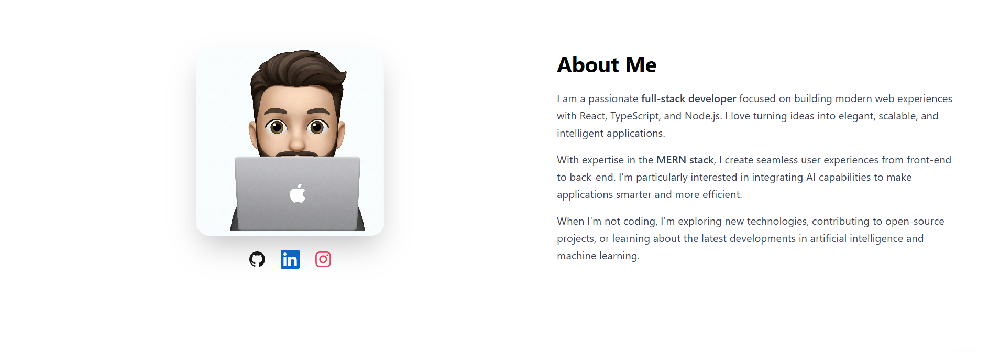

<div align="center">

# Welcome to My Portfolio Website! 🌟



### 🚀 A seamless blend of style and functionality, showcasing my journey, projects, and skills in the tech world!

Built with modern web technologies and a touch of creativity to provide an interactive user experience. Dive in, explore, and let's connect!

<br/>


</div>

---

---

## 📸 Screenshots

<div align="center">

### About Me Section


</div>

---

## 🎯 What's Inside?

- ✨ **Hero Section** – Animated typing effects with floating tech icons
- 🛠️ **Skills Grid** – Showcase of 22+ technologies with SVG logos
- 💼 **Projects** – Swipeable project cards with live demos
- 📧 **Contact Form** – Working email integration via EmailJS
- 📱 **Fully Responsive** – Looks great on any device
- 🎨 **Smooth Animations** – Powered by Framer Motion & GSAP

## ✨ Features

- 🎨 **Interactive UI/UX** – User-friendly interface with engaging interactive elements
- 📱 **Responsive Design** – Optimized for all screen sizes and devices
- 🎭 **Smooth Animations** – Enhanced transitions and dynamic effects
- 🧭 **Smart Navigation** – Fixed navbar with section detection and smooth scrolling
- 🎯 **SEO Optimized** – Complete with sitemap.xml and robots.txt
- ⚡ **Fast Performance** – Lightning-fast builds with Vite
- 🔒 **Secure** – HTTPS connection for data protection

## 🛠️ Technologies Used

<div align="center">

### Frontend


### Animation & Effects


### Tools & Services  


</div>

---

## 🚀 Installation and Usage

### 📋 Prerequisites
- Node.js (v18 or higher)
- npm or yarn

### 1️⃣ Clone the Repository

```bash
git clone https://github.com/shubhamrajput27/Portfolio.git
cd Portfolio
```

### 2️⃣ Install Dependencies

```bash
npm install
```

### 3️⃣ Start Development Server

```bash
npm run dev
```

Open your browser and visit `http://localhost:5174` 🎉

### 🔐 Environment Variables (Optional)

For the contact form to work, create a `.env` file:

```env
VITE_EMAILJS_SERVICE_ID=your_service_id
VITE_EMAILJS_TEMPLATE_ID=your_template_id
VITE_EMAILJS_PUBLIC_KEY=your_public_key
```

Get your free credentials at [EmailJS](https://www.emailjs.com/)

---

## 📦 Build & Deploy

### Build for Production

```bash
npm run build
```

### Preview Build

```bash
npm run preview
```

### 🚀 Deploy to Vercel

1. Visit [vercel.com](https://vercel.com) and sign up
2. Import your repository
3. Click "Deploy"

Auto-deploys on every push to `main`. Add environment variables in Project Settings.

---

## 📁 Project Structure

```
Portfolio/
├── public/              # Static files (favicon, resume, etc.)
├── src/
│   ├── components/      # All React components
│   ├── data/            # Portfolio content (Data.ts)
│   ├── hooks/           # Custom hooks
│   └── lib/             # Utility functions
├── index.html
└── package.json
```

## 🎨 Customization

### Theme Colors
Edit `tailwind.config.js`:
```javascript
colors: {
  primary: '#ff6f10',    // Orange accent
  cream: '#fff7f0',      // Background
  peach: '#ffd8c5',      // Secondary
}
```

### Content Updates
- **Projects**: `src/components/Projects/Projects.tsx`
- **Skills**: `src/components/Skills/SkillsGrid.tsx`
- **About**: `src/data/Data.ts`
- **Experience**: `src/components/Experience/Experience.tsx`

---

## 📧 Contact Form Setup

1. Sign up at [EmailJS](https://www.emailjs.com/)
2. Create an email service and template
3. Get Service ID, Template ID, and Public Key
4. Add to `.env` or hosting environment variables

---

## 🤝 Contributing

Contributions welcome! Fork the repo, make changes, and open a pull request.

Please:
- Don't use my images/content for your portfolio
- Credit this repo if you use any code
- Maintain the open-source spirit

---

## 👨‍💻 About Me

<div align="center">

I'm **Shubham Singh**, a passionate full-stack developer focused on building modern web experiences with React, TypeScript, and Node.js. I love turning ideas into elegant, scalable, and intelligent applications.

When I'm not coding, I'm exploring new technologies, contributing to open-source projects, or learning about the latest developments in AI and machine learning.

### Let's Connect!

[](https://github.com/shubhamrajput27)
[](https://www.linkedin.com/in/shubham-singh-a96623290/)
[](https://www.instagram.com/shubh_rajput.27)
[](mailto:shubhamrajput2702@gmail.com)

</div>

---

## 📄 License

This project is open-source and available under the **MIT License**.

### MIT License

```
MIT License

Copyright (c) 2024-2025 Shubham Singh

Permission is hereby granted, free of charge, to any person obtaining a copy
of this software and associated documentation files (the "Software"), to deal
in the Software without restriction, including without limitation the rights
to use, copy, modify, merge, publish, distribute, sublicense, and/or sell
copies of the Software, and to permit persons to whom the Software is
furnished to do so, subject to the following conditions:

The above copyright notice and this permission notice shall be included in all
copies or substantial portions of the Software.

THE SOFTWARE IS PROVIDED "AS IS", WITHOUT WARRANTY OF ANY KIND, EXPRESS OR
IMPLIED, INCLUDING BUT NOT LIMITED TO THE WARRANTIES OF MERCHANTABILITY,
FITNESS FOR A PARTICULAR PURPOSE AND NONINFRINGEMENT. IN NO EVENT SHALL THE
AUTHORS OR COPYRIGHT HOLDERS BE LIABLE FOR ANY CLAIM, DAMAGES OR OTHER
LIABILITY, WHETHER IN AN ACTION OF CONTRACT, TORT OR OTHERWISE, ARISING FROM,
OUT OF OR IN CONNECTION WITH THE SOFTWARE OR THE USE OR OTHER DEALINGS IN THE
SOFTWARE.
```

See the [LICENSE](LICENSE) file for more details.

---

## 🌟 Show Your Support

If you found this helpful or inspiring:
- ⭐ **Star this repository**
- 🍴 **Fork it** and make it your own
- 📣 **Share it** with others

---

<div align="center">

**Created with ❤️ by [Shubham Singh](https://github.com/shubhamrajput27) in 2025**

*Built with React, TypeScript, Tailwind, and way too much coffee ☕*

**Happy Coding! 🚀**

</div>
